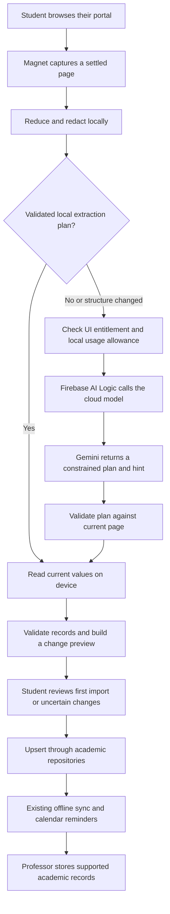

# Academia universal portal sync: research and implementation plan

**Checkpoint status: INCOMPLETE AND HIGHLY UNSTABLE.** Save the current partial
implementation for continued development; outstanding phases remain unfinished.

Research date: 2026-10-04. Status: implementation of the internal courses-and-timetable
slice is underway. See [the pilot setup guide](portal-sync-internal.md) for the implemented
boundaries, configuration, verification, and remaining work. The findings below describe
the checkout before this implementation.
Updated direction: direct Firebase AI Logic for a closed internal pilot; Firebase
billing enforcement follows before wider distribution. Professor remains the academic
storage backend for this feature.

## Recommendation

Build Magnet into an AI-assisted observer of the student's signed-in portal session.
Capture relevant information as the student browses, learn unfamiliar page structures,
and reuse validated extraction plans locally. Prefer calendar feeds and structured
downloads when available. Use cropped screenshots or documents when page text cannot
be read reliably.

Prioritize one polished courses-and-timetable flow that can be shipped to a small
group of trusted internal testers. Use the existing client billing check and call
Gemini through Firebase AI Logic directly. Keep Professor out of portal inference;
save validated academic records through the existing repositories and storage APIs.
Do not make Firebase subscription enforcement, on-device inference, or the full legacy
package migration prerequisites for this pilot. Profile, fees, import alternatives,
and the remaining migration still belong to the upgrade and follow the first slice.

The student should be able to enter a portal address, sign in themselves, follow a few
contextual hints, and see their courses, timetable, profile, and fees appear in Academia.
There must be no requirement for an administrator to write, review, or publish a school
recipe before a student can import information.

This can remove routine maintenance of individual school scrapers. It cannot guarantee
compatibility with every website or eliminate maintenance of the capture engine, model
integration, and data validation. Distinguish two capabilities in the product:

- Portal capture updates automatically while the student browses an active supported
  portal session. Session expiry or MFA may require the student to sign in again.
- Calendar subscriptions can refresh in the background where the school provides a
  usable feed. Background jobs remain subject to operating system scheduling.

## Findings in the current checkouts

| Finding | Evidence | Consequence |
| --- | --- | --- |
| The new portal is restricted to one institution and origin. | `lib/features/institution/presentation/models/daystar_portal_models.dart` | Replace the policy, route, models, and copy with a user-selected portal connection. |
| Sync requires a published recipe; teaching submits a capture for review. | `lib/features/institution/data/services/daystar_portal_actions_impl.dart` | The current flow still needs operator intervention. |
| The client requests recipe and teaching endpoints that this Professor checkout does not expose. | Client datasource versus `/home/erick/Projects/opencrafts/professor/magnet/urls.py` | Remove these dependencies from the new flow and analyze through Firebase AI Logic. |
| Generated dependency configuration points Magnet at a missing temporary checkout. | `.dart_tool/package_config.json` references `/tmp/academia-magnet-pilot/`; the directory is absent. | Restore a reproducible dependency before using build results as evidence. This inspection did not run a build. |
| Both the sibling Magnet checkout and cached Git dependency expose command execution; the inspected sources lack `executeInWebView` and the proposed cancellation API. | Magnet engine sources in the sibling checkout and pub cache | Establish the actual package API and implement/test observation against it. |
| Courses and schedules already have modular repositories and offline sync. | `packages/courses/`, `packages/database/` | Extend their import boundary instead of duplicating persistence. |
| Current saves use create operations that allocate new IDs. | Course repository and portal actions | Add stable source identity and upserts; repeated imports must not duplicate records. |
| The schedule model supports weekdays and specific dates, but lacks full source timezone and recurrence semantics. | `packages/courses/lib/src/domain/entities/schedule_entry_entity.dart` | Add support deliberately; do not flatten richer schedules incorrectly. |
| Fee currency defaults to KES, and institution domain entities depend on legacy database types. | Institution fee/profile entities | Remove regional assumptions and separate domain models from persistence. |
| Professor already has Verisafe authentication and a Gemini integration for notes. | Professor settings and `notes/llm/gemini.py` | Preserve shipped notes behavior; add no portal inference service to Professor. |
| Billing already checks subscription status and numeric entitlements on the client. | `packages/billing/lib/src/domain/services/billing_service.dart` and the entitlement entity | Reuse for internal UI access; add trusted enforcement in Firebase before wider distribution. |

Academia contains existing uncommitted pilot work. Preserve it during investigation and
replace obsolete pieces deliberately during implementation. Professor was clean at
inspection. The research itself did not change application code; implementation now
replaces the obsolete pilot in Academia. Professor is unchanged.

## Research informing the design

Firebase AI Logic supports Flutter, multimodal input, and structured output. It is a
viable provider integration, but capture still has to be implemented in Magnet; adding
an SDK does not give the model access to the student's browser. See the
[Firebase overview](https://firebase.google.com/docs/ai-logic) and
[structured output documentation](https://firebase.google.com/docs/ai-logic/generate-structured-output).

Firebase's ordinary AI Logic per-user quota is an RPM limit applied uniformly across
users. It helps bound pilot traffic but does not enforce subscription allowances.
Firebase also supports blocking or modifying requests with server triggers, but
those triggers are in Preview and currently only intercept `generateContent`;
streaming and Live requests bypass them. Do not treat those hooks alone as complete
subscription enforcement for unrestricted direct client access. See
[quotas](https://firebase.google.com/docs/ai-logic/quotas) and
[request triggers](https://firebase.google.com/docs/ai-logic/pre-and-post-request-scripts).

The internal implementation uses an injected analysis interface backed by the Flutter
Firebase AI Logic SDK. The existing BillingService gates the UI; caching and local
usage counters reduce ordinary usage. This is an accepted temporary tradeoff for a
closed group of trusted testers: a modified client can bypass UI gates and counters.
Keep distribution closed until trusted enforcement is added.

Before wider distribution, route cloud analysis through a Firebase callable function
that verifies the account's subscription and atomically reserves its allowance before
calling Gemini. Keep model access server-side and remove the unrestricted direct
client inference path. Change the analysis adapter without rewriting capture,
extraction, review, or import logic. Professor remains outside that workflow.

Firebase's authenticated-users mode requires Firebase Authentication, while Academia
uses Verisafe. Add a trusted bridge that verifies the existing session and issues a
Firebase custom token tied to the same account when server enforcement is introduced.
Do not require a second student login. See
[Firebase authentication requirements](https://firebase.google.com/docs/ai-logic/auth-mode)
and [custom authentication](https://firebase.google.com/docs/auth/admin/create-custom-tokens).

True on-device inference is a later optimization. Direct Flutter SDK calls still use
cloud models. Local model availability and quality vary by platform and device; the
pilot must work without requiring local inference support.

Google forbids Google OAuth authorization in developer-controlled embedded browsers.
This is a material limit on some school SSO flows. Opening a system browser does not
automatically transfer its authenticated portal cookies into Magnet. Provide a
supported import alternative when session handoff is unavailable; do not assume that
handoff exists. See [Google OAuth policies](https://developers.google.com/identity/protocols/oauth2/policies).

Calendar feeds deserve an early place in the product. Canvas offers calendar
subscriptions and Moodle offers calendar export. They can import events without
maintaining selectors or repeatedly asking AI, but only include what the school puts
in those calendars; they may contain deadlines without lecture times. See
[Canvas subscriptions](https://community.instructure.com/en/kb/articles/661639-unknown)
and [Moodle calendar export](https://docs.moodle.org/502/en/Using_Calendar).

The existing InAppWebView dependency supplies a JavaScript bridge with origin and
frame controls. Use those controls for the generic observer and explicitly evaluate
iframes and platform differences in the prototype. See
[InAppWebView communication](https://inappwebview.dev/docs/webview/javascript/communication/).

## Capture and extraction

This diagram describes the internal pilot. The later Firebase callable adapter
enforces entitlement and usage server-side before inference. Professor receives
ordinary supported records after validation; it does not receive portal snapshots,
prompts, model requests, or AI usage counters.

1. Start from a selected or pasted HTTPS school portal URL. Allow schools absent from
   the directory to create a private connection. Resolve institution identity through
   the institution service without requiring a scraping configuration or publishing
   an unverified domain as an official school entry.
2. The student signs in. Observe approved portal content origins only. Authentication
   pages and external identity providers are excluded from capture. Permit additional
   content origins explicitly for schools whose records live across multiple sites.
3. Capture headings, labels, table structure, relevant visible text, links, and node
   references after navigation and meaningful settled DOM changes. Support SPA route
   changes, tabs, scrolling, pagination, and lazy rendering. Debounce changes and
   deduplicate snapshots; keystrokes must not trigger inference.
4. Use generic structural parsers for tables and labelled fields. Send a reduced
   representation to AI when semantics or layout are unfamiliar. Prefer structure
   and redacted samples to whole HTML. Preserve language cues; an English label
   whitelist cannot support worldwide portals.
5. Ask AI for a schema-constrained page category, field mappings, permitted node
   references, missing categories, and an optional navigation hint. Return unsupported
   or ambiguous fields as unknown. Model confidence is advisory, not proof of accuracy.
6. Validate the plan locally, then read actual values on device wherever possible.
   On first use, show a useful preview. Cache only plans that pass structural and
   semantic checks. Revalidate every execution; invalidate on changed structure,
   account context, schema version, or failed checks and perform bounded relearning.
   After the first confirmed import, let the student enable automatic saving of
   validated updates. Hold ambiguous fields, conflicting edits, and removals for review.
7. Use an explicitly selected, redacted screenshot crop or document when text/DOM
   extraction is inadequate. This path may send selected student data to the model;
   explain that at the point of use. Do not claim all AI processing stays on device.
8. Guide the student using links or controls that exist on the current page: for
   example, highlight a detected "Class timetable" control. When no suitable control
   exists, ask them to open their timetable using the portal menu. Do not fabricate
   a location or navigate automatically into an unverified action.

The new extraction plan is internal cached metadata, learned at runtime. It is not a
manually maintained school recipe. Start with private plans on the student's device;
sharing validated, sanitized layout metadata is a later optimization, not a launch
dependency. No student values, cookies, identifiers, or personalized URLs belong in
a shared cache.

## Cost and abuse controls

Maintain three distinct caches:

- Validated extraction plans: keyed by exact portal origin, structural fingerprint,
  page category, language, and plan/schema version. Reuse a plan to read fresh values.
- Private analysis results: keyed by account, connection, goal, content hash, and model
  and prompt versions. Never reuse one student's extracted values for another student.
- Imported records: durable local data with source identity, last observed time,
  completeness, and provenance. Show cached records offline with their freshness.

A cache hit saves an AI call; it does not prove the school has not changed a page the
student has not revisited. Report last checked times separately for each category.

Internal pilot controls, required before distributing the build:

- Use closed distribution to a known, small tester group and gate the UI through the
  existing BillingService. No public rollout or unrestricted install links.
- Use a dedicated testing Firebase project so portal inference limits do not interrupt
  shipped services. Enforce App Check and lower provider/project and Firebase request
  quotas to the pilot's measured needs. App Check does not verify subscriptions.
- Configure a small monthly service spend cap and alerts. Firebase spend caps are in
  Preview and are not instantaneous hard caps: usage reporting can delay enforcement
  and overages remain billable. Leave headroom below the actual tolerated spend. See
  [Firebase spend caps](https://firebase.google.com/docs/projects/billing/spend-caps)
  and [AI Logic launch guidance](https://firebase.google.com/docs/ai-logic/production-checklist).
- Keep model selection and an operational feature switch configurable. The client
  switch helps manage trusted pilot builds; it is not a server authorization boundary.

Proposed client limits, adjustable after measurement:

- Up to six model attempts/day during initial setup; up to four/day afterward and
  thirty/month per Academia account. Reconnecting must not reset account budgets.
- Bound each ordinary request to 8,000 input tokens and 1,000 total output/thinking
  tokens where supported; define equivalent provider limits and reject oversized
  requests. Documents and images need separate byte/page/pixel ceilings.
- One in-flight analysis per connection; coalesce identical requests. Use one approved
  low-cost model for the first pilot and permit at most one retry per analysis,
  counted against the allowance. Stronger-model escalation can follow measured need.
- Persist counters by Academia account so normal reconnects do not reset the local
  allowance. These counters are best-effort pilot controls, not tamper-proof budgets.
- A refresh first re-reads the page locally. It does not force a model request.
  Cached/offline reading remains available when inference is paused or exhausted.

Before wider distribution, the billing backend remains the subscription authority.
Send verified subscription changes to Firebase or use a bounded, server-verified
access cache. Store the entitlement, allowance, billing period, and expiry in records
the client cannot edit. Handle renewal, expiry, refunds, duplicate/out-of-order
updates, and reconciliation. Cancellation must respect the paid access period.
Never accept a client-selected plan or account identity as authoritative.

The Firebase callable gateway checks those records and atomically reserves token,
request, and monetary allowances before inference. Reconcile actual billable usage,
including failures, timeouts, and retries, and apply a project-wide budget policy.
Subscription access and remaining usage are separate checks: a subscriber does not
receive unlimited inference. A later provider swap must not bypass this boundary.
Keep saved academic information accessible when the subscription expires.

Benchmark currently supported Flash-Lite candidates before choosing the default. The
current pricing lists Gemini 3.5 Flash-Lite at $0.30/M input and $2.50/M output tokens,
and 3.1 Flash-Lite at $0.25/M and $1.50/M. At 8,000 input plus 1,000 output tokens,
one 3.5 analysis is approximately $0.0049. Four analyses for each of 10,000 students
would be about $196 in model charges, excluding infrastructure, media variations, and
escalations. These are calculations, not measured usage. Use paid processing for
student data: the pricing table distinguishes free-tier product-improvement use from
paid-tier handling. See [Gemini pricing](https://ai.google.dev/gemini-api/docs/pricing).

Provider context caching is secondary to avoiding calls entirely. Firebase documents
implicit caching without guaranteed savings and limits explicit caching access to
server prompt templates. Only add it if measured repeated prompt volume justifies
storage and operational costs. See
[Firebase context caching](https://firebase.google.com/docs/ai-logic/context-caching).
Keep model and prompt versions configurable; verify availability before release using
the [supported model list](https://firebase.google.com/docs/ai-logic/models).

## Data quality and student protection

Use typed records with field-level evidence: source page/document, observation time,
source account, original value, normalized value, and validation outcome. Import only
supported app fields. Minimize profile data; national identity and disability fields
should not be collected merely because the portal displays them.

For courses and timetables, capture course identity, term, section, lecturer where
available, venue, local meeting times, source timezone, recurrence, start/end dates,
and exceptions. Handle weekly and alternating-week schedules, one-off sessions,
exam dates, holidays, and cancellations deliberately. Extend the schedule model for
semantics it cannot represent; never silently reduce alternating weeks to every week.
Ask for missing timezone or term dates instead of inferring from the student's phone.

Calendar imports must preserve event UIDs, timezone, recurrence rules, and exceptions.
Keep deadlines separate from class meetings using the existing agenda/task boundaries.
Protect private feed URLs as credentials. If a backend fetches feeds, constrain URL
schemes, redirect chains, network destinations, and response sizes to prevent SSRF.

For fees, retain currency and decimal amounts; distinguish debit, credit, running
balance, and balance due. Do not default an unknown currency to KES or an unknown
amount to zero. Preserve localized date and number formats until validated.

Define stable import identities from portal IDs where available; otherwise use
connection, school account, term, course/section, and record-specific evidence.
Keep matching identity separate from mutable values such as lecture time. Upsert
updates, preserve manual edits through conflict handling, and make saves replayable.
Absence from a partial capture is not a deletion. Record which pages/terms were
completely observed before proposing removals. Confirm destructive or uncertain changes.

Migrate relevant profile/fee persistence into the same database as courses before
promising a single local transaction. If a transition spans stores, use a durable
import ledger with resumable steps and report partial status honestly. Successful
imports feed the existing sync queue and reminder system; they do not create another
independent sync mechanism.

Keep portal credentials and cookies in the isolated browser session. Never include
passwords, form inputs, session storage, tokens, or cookies in AI requests or logs.
Persist sessions only with an explicit remember choice and clear them on disconnect.
Pause capture immediately on sign-out/account switch; reject late responses from the
old session. Delete private caches on disconnect according to the retention policy.

Treat portal content and model output as untrusted. The new observer can read approved
elements and suggest user navigation. It cannot run AI-generated JavaScript, submit
forms, pay fees, register/drop courses, or execute the legacy arbitrary command surface.
Validate output and use fixed local extraction operations. Minimize content sent to
Firebase/Gemini and disable raw portal payload logging in the app and any later
Firebase gateway. Professor's normal storage validation remains in place.

## Package boundaries and migration

Use `lib/` for application startup, composition, and integrations. Build the new
portal automation in a standalone package from the start. For the internal slice,
inject app-owned adapters for existing identity, billing, and institution interfaces
at the composition root; the new package must not import legacy app features.
Migrate institution/profile/fee ownership and remaining features incrementally after
the portal capability is proven. Full migration is not an internal release gate.

| Module | Responsibility |
| --- | --- |
| Magnet package, under a reproducible dependency | Generic browser observation, capture policy, snapshot types, bounded extraction, and an injected analysis interface. No Academia repositories or vendor-specific domain dependency. |
| `packages/portal_sync/` (new) | Connection/session lifecycle, injected analysis interface with a Firebase AI Logic data adapter, cache policies, typed import drafts, hints, review UI, and import coordination. |
| `packages/institutions/` (new) | Directory, memberships, academic student profile, fee records, repositories, and institution-facing screens. |
| `packages/courses/` (existing) | Courses, lecturers, meeting schedules, source-aware upserts, and existing offline sync/reminders. |
| `packages/agenda/` (existing) | Calendar presentation and non-class event integration through explicit boundaries. |
| `packages/database/` (existing) | Migrations, import ledger, provenance, caches, and academic persistence. |
| `packages/core/` (existing) | Stable shared errors/network abstractions; avoid accumulating feature logic here. |
| `packages/design_system/` (later, small) | Shared Material theme/motion tokens and components once reuse justifies extraction; the pilot uses the existing theme and polished package-local components. |

Inside each feature package use `src/domain`, `src/data`, and `src/presentation`, with
explicit public exports and dependency registration. Domain owns entities and
repository interfaces; data implements those interfaces; presentation calls use
cases. Inject browser, provider, account, and persistence adapters. Domain must not
import WebView controllers, Firebase SDKs, database row types, or app BLoCs. Packages
must not import `package:academia/...`. Preserve the established BLoC/GetIt conventions
and avoid making a new abstraction for every trivial method.

Inventory remaining `lib/features` and shared `lib/core`/database dependencies.
After the first internal slice, migrate authentication/profile dependencies where
stable account interfaces are needed, followed by academic semester/timetable/exam
features; consolidate the old course feature with the existing courses module.
Migrate the social/event/streak/home features in
separate behavior-preserving units with their own verification. Their functionality
must not be rewritten as part of portal inference.

Add no portal analysis endpoints, prompts, model adapters, AI counters, or subscription
enforcement to Professor. For this feature it stores academic records through its
existing contracts. Any necessary storage schema changes are additive and independently
verified. Preserve the existing notes AI implementation and all shipped notes, courses,
exams, and other contracts; the portal boundary does not authorize removing notes AI.

Delete obsolete Daystar routes, manual-teaching UI, recipe datasource, unused command
integration, and redundant mappers after replacement paths are verified. This
Professor checkout has a legacy command model rather than the proposed recipe service.
Check shipped clients and live usage before retiring its endpoints. Removing dead
code does not authorize dropping historical migrations or production data.

## Student experience and design standard

The main flow is: connect school, sign in, browse with guidance, review first import,
then see updates and freshness. The default presentation is visual academic data;
JSON, selectors, recipes, and model names are developer details.

Example copy:

- "Open your school portal. Sign in as you normally would."
- "Found 6 courses. Open your timetable to add class times."
- "Your timetable is saved. We still need your fee statement."
- "Two class times changed. Review changes."
- "Your portal session ended. Sign in to check for updates."
- "Saved information is available. We can check unfamiliar pages again tomorrow."

Use a full-height portal browser with a compact expandable assistant sheet. Show
profile/courses/timetable/fees as clear progress categories, each with found, missing,
review, and last-checked states. Highlight a suggested portal target only while it
still exists; keep it scroll-aware and avoid covering the target. Make partial imports
useful and allow pause, resume, cancel, and discard.

Use Material 3 tonal surfaces, dynamic color, emphasized typography, generous shape,
connected controls, and spring motion that communicates state changes. Build on the
existing dynamic theme and animation dependencies, checking Flutter's actual component
support rather than assuming every Compose API exists in Flutter. References:
[Material 3 Expressive](https://m3.material.io/blog/building-with-m3-expressive),
[motion guidance](https://m3.material.io/styles/motion/overview/how-it-works), and
[Flutter Material](https://docs.flutter.dev/ui/design/material).

Design acceptance includes light/dark/dynamic themes, 48dp touch targets, readable
contrast, screen-reader announcements, large text, reduced motion, and tablet layouts.
Profile animation performance on a midrange Android device and supported iPhone;
target the device frame budget. Show actual discovered counts and operation states,
not invented progress percentages. Test the wording and flow with students unfamiliar
with scraping or AI. "Google-quality" becomes a visual prototype, motion review,
device checks, and usability evidence, not a claim based on using Material widgets.

The first internal slice includes this polish for connect, browser guidance,
course/timetable review, saved results, and failure/offline states. Do not defer all
design work to a final phase. Show profile/fees as later capabilities until implemented;
never imply that an unavailable category was checked and found empty.

## Delivery phases and acceptance gates

| Phase | Deliverable | Acceptance gate |
| --- | --- | --- |
| 1. Ship the internal vertical slice | Reproducible Magnet dependency and baseline; new portal-sync package; direct Firebase AI Logic adapter; existing UI billing gate; capture, hints, course/timetable review, source-aware saves, local caches, and pilot cost controls. | Complete one unfamiliar authorized portal end to end without hand-written school selectors. Repeat import creates zero duplicates; unchanged pages make zero AI calls; manual edits survive; partial capture does not delete records. Verify App Check, test project limits/spend cap, polished real-device states, and existing affected feature checks. Distribute only to trusted internal testers. |
| 2. Expand coverage and supported data | Profile and fees; institution package migration; calendar subscriptions and document/image alternatives; language and recurrence support; broader student usability evaluation. | Evaluate at least three unfamiliar authorized layouts, including an SPA, localized/non-English content, and SSO/document fallback. Report field accuracy, failures, latency, tokens, and cost. Ambiguous fees/times are held for review. |
| 3. Enforce Firebase billing before wider distribution | Verisafe-to-Firebase identity bridge; trusted subscription synchronization; callable inference adapter; atomic usage reservations, reconciliation, and global budget policy. | Expired/missing entitlements block cloud inference; concurrent requests, reconnects, and modified clients cannot bypass account allowances or use an unrestricted parallel inference route. Saved data remains accessible. Professor has no new portal inference dependency. |
| 4. Complete modular migration and cleanup | Remaining institution/profile/fee persistence and feature migration; shared design components where justified; obsolete Daystar/teaching/recipe integration cleanup. | Migrated packages do not import the app package; database migrations and affected feature/backend regression checks pass. Preserve shipped clients, notes AI, and historical migrations. |
| 5. Optimize from measured usage | Optional on-device provider, bounded stronger-model fallback, sanitized shared layout metadata, and provider caching where justified. | Demonstrate a measured improvement in cost, latency, or accuracy without excluding unsupported phones, weakening billing enforcement, or sharing student values. These optimizations do not block the internal pilot. |

Use synthetic fixtures plus authorized anonymized captures with known expected values.
Keep an unseen-layout evaluation set to test generalization rather than memorization.
Compare first-use and cached-use accuracy, completion time, AI requests, token cost,
cache hits, schema failures, and record duplication. Release only when high-impact
fields are correct or explicitly held for review; measure fees and class times
separately from page-classification accuracy.

The first milestone is a working, polished internal courses-and-timetable release
with direct Firebase inference and known temporary UI-only subscription gating.
Firebase server billing enforcement is required before wider distribution, not before
the trusted pilot. Complete the remaining supported data and modular migration in
subsequent increments; keep Professor outside portal AI throughout.
